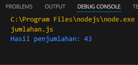

# JURNAL MODUL 5
### Nama: Muhammad Samudra
### NIM: 2211104062

---


### Soal Nomor 1
MENAMBAHKAN METHOD DENGAN GENERIC Tanpa membuat file baru (gunakan file yang dibuat saat membuat project): A. Buatlah sebuah class bernama “Penjumlahan”. B. Pada class tersebut, tambahkan sebuah method dengan nama “JumlahTigaAngka” yang memiliki tiga parameter generic yang sama yaitu “T” C. Method tersebut dapat melakukan penjumalahan dari tiga input/argument yang diberikan pada method tersebut. D. Hint: gunakan variable sementara dengan tipe data dynamic untuk memungkinkan operasi matematis misalnya penjumlahan. E. Panggil method tersebut pada fungsi/method utama dengan tiga input angka yaitu 2-digit dari NIM. Misalnya NIM 12345678, maka tiga input angka yaitu “12”, “34” dan “56” dengan tipe data sebagai berikut: i. NIM berakhiran 1 atau 2: tipe data input float ii. NIM berakhiran 3, 4 atau 5: tipe data input double iii. NIM berakhiran 6, 7 atau 8: tipe data input int iv. NIM berakhiran 9 atau 0: tipe data input long

`penjumlahan.js`
``` js
class Penjumlahan {
    JumlahTigaAngka(a, b, c) {
      let hasil = a + b + c;
      return hasil;
    }
  }
  
  // NIM: 2211104062
  // Tiga input angka: 22, 11, 10
  // NIM berakhiran 9; tipe data float
  
  const angka1 = parseFloat(22.0);
  const angka2 = parseFloat(11.0);
  const angka3 = parseFloat(10.0);
  
  const penjumlahan = new Penjumlahan();
  const hasil = penjumlahan.JumlahTigaAngka(angka1, angka2, angka3);
  
  console.log(`Hasil penjumlahan: ${hasil}`);

  ```

  **Output**


---

### Soal nomor 2
MENAMBAHKAN METHOD DENGAN GENERIC Tanpa membuat file baru (gunakan file yang dibuat saat membuat project dan pastikan branch aktif adalah pada branch implementasi-generic-class): A. Buatlah sebuah class bernama “SimpleDataBase” dengan mengikuti class model yang ditunjukkan pada gambar/tabel di bawah ini. SimpleDataBase

(-) storedData: List (T) (-) inputDates: List (Date)

(+) SimpleDataBase() (+) AddNewData(T) (+) PrintAllData(): void

B. Class tersebut memiliki dua property yaitu: i. Property “storedData” yang merupakan suatu List (struktur data bawaan/default) yang berisi data bertipe generic “T”. ii. Property “inputDates” yang bertipe List (atau tipe data List di C#) yang akan list dari waktu input. C. Class tersebut juga memiliki beberapa method yaitu: i. Konstruktor SimpleDataBase() yang akan membuat property “storedData” berisi List kosong. ii. Method AddNewData(T) yang akan menambahkan data baru bertipe T ke dalam list “storedData” dan waktu saat itu (Now) ke dalam list “inputDates”. iii. Method PrintAllData() yang akan memberikan output console berupa teks yang menampilkan seluruh data yang tersimpan pada “storedData” dan “inputDates”, contohnya: • Data 1 berisi: 12, yang disimpan pada waktu UTC: 3/10/2022 5:32:01 AM • Data 2 berisi: 34, yang disimpan pada waktu UTC: 3/10/2022 5:32:02 AM • Data 2 berisi: 56, yang disimpan pada waktu UTC: 3/10/2022 5:32:02 AM D. Panggil method PrintAllData() pada fungsi/method utama setelah menambahkan

`SimpleDataBase.js`

```js
class SimpleDataBase {
    constructor() {
        this.storedData = [];
        this.inputDates = [];
    }

    AddNewData(data) {
        this.storedData.push(data);
        this.inputDates.push(new Date().toUTCString());
    }

    PrintAllData() {
        this.storedData.forEach((data, index) => {
            console.log(`Data ${index + 1} berisi: ${data}, yang disimpan pada waktu UTC: ${this.inputDates[index]}`);
        });
        }
}

const database = new SimpleDataBase();

database.AddNewData(22);
database.AddNewData(11);
database.AddNewData(10);
database.PrintAllData();
```

**Output**
