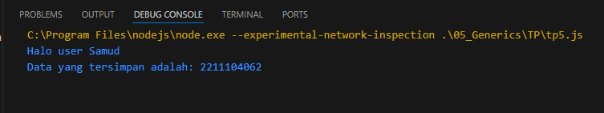

# TP MODUL 5
### Nama: Muhammad Samudra
### NIM: 2211104062

---

**Code:**
```java
class HaloGeneric {
    SapaUser(user) {
        console.log(`Halo user ${user}`);
    }
}

const halo = new HaloGeneric();
halo.SapaUser("Samud");

class DataGeneric {
    constructor(data) {
        this.data = data;
    }

    PrintData() {
        console.log(`Data yang tersimpan adalah: ${this.data}`);
    }
}

const nim = "2211104062";
const dataGeneric = new DataGeneric(nim);
dataGeneric.PrintData();
```

### **Penjelasan:**
Terdapat dua buah class generic yaitu HaloGeneric dan DataGeneric. HaloGeneric memiliki method SapaUser dengan cara memanggil nilainya langsung pada argumen methodnya. Sementara class DataGeneric mempunyai method PrintData dengan cara memanggil nilai nya dengan mengambil dari properti class nya (data)

### **Output**
