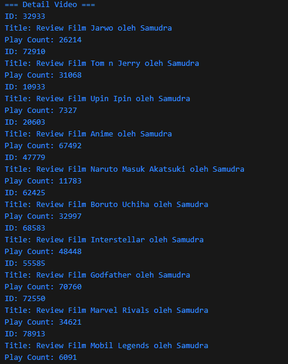
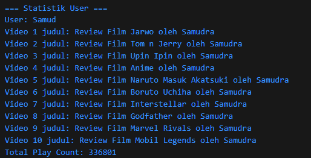
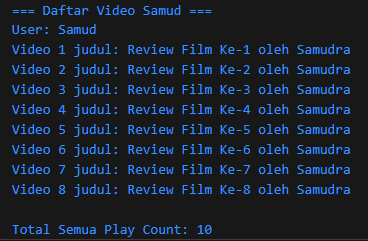

# JURNAL MODUL 6
### Nama: Muhammad Samudra
### NIM: 2211104062

---

### Commit Pertama

`sayaTubeVideo.js`

```js
class SayaTubeVideo {
  constructor(title) {
    if (!title || typeof title !== "string" || title.length > 100) {
      throw new Error("Judul video harus string dan maksimal 100 karakter.");
    }

    this.id = this.#generateRandomId();
    this.title = title;
    this.playCount = 0;
  }

  #generateRandomId() {
    return Math.floor(10000 + Math.random() * 90000);
  }

  increasePlayCount(count) {
    if (typeof count !== "number" || count <= 0 || count > 10000000) {
      throw new Error(
        "Penambahan playCount harus antara 1 sampai 10.000.000."
      );
    }

    this.playCount += count;
  }

  printVideoDetails() {
    console.log(`ID: ${this.id}`);
    console.log(`Title: ${this.title}`);
    console.log(`Play Count: ${this.playCount}`);
  }
}

module.exports = SayaTubeVideo;

```

`sayaTubeVideo` berfungsi untuk menyimpan informasi video seperti id, title, dan play count. id dibuat dengan menambahkan 10000 dengan math.random()*90000 untuk mendapatkan bilangan acak sepanjang 5 digit. Di class ini views (playCount) diisi nilai 0 dan terdapat method untuk menambahkan views. Views ditambahkan di `main.js`

`sayaTubeUser.js`

```js
const SayaTubeVideo = require("./sayaTubeVideo");

class SayaTubeUser {
  constructor(username) {
    if (!username || typeof username !== "string" || username.length > 100) {
      throw new Error("Username harus string dan maksimal 100 karakter.");
    }

    this.username = username;
    this.uploadedVideos = [];
  }

  addVideo(video) {
    if (!(video instanceof SayaTubeVideo)) {
      throw new Error(
        "Hanya objek dari kelas SayaTubeVideo yang bisa ditambahkan."
      );
    }

    this.uploadedVideos.push(video);
  }

  getTotalVideoPlayCount() {
    return this.uploadedVideos.reduce(
      (total, video) => total + video.playCount,
      0
    );
  }

  printAllVideoPlaycount() {
    console.log(`User: ${this.username}`);
    this.uploadedVideos.forEach((video, index) => {
      console.log(`Video ${index + 1} judul: ${video.title}`);
    });
  }
}

module.exports = SayaTubeUser;
```

`sayaTubeUser.js` berfungsi untuk menyimpan informasi tentang user, yaitu Username dan list video yang terunggah, dan juga untuk menghitung dan menampilkan total views dari seluruh video yang diunggah.

`main.js`

```js
const SayaTubeVideo = require("./sayaTubeVideo");
const SayaTubeUser = require("./sayaTubeUser");

function main() {
  const username = "Samud";
  const user = new SayaTubeUser(username);

  const judulFilm = [
    "Review Film Jarwo oleh Samudra",
    "Review Film Tom n Jerry oleh Samudra",
    "Review Film Upin Ipin oleh Samudra",
    "Review Film Anime oleh Samudra",
    "Review Film Naruto Masuk Akatsuki oleh Samudra",
    "Review Film Boruto Uchiha oleh Samudra",
    "Review Film Interstellar oleh Samudra",
    "Review Film Godfather oleh Samudra",
    "Review Film Marvel Rivals oleh Samudra",
    "Review Film Mobil Legends oleh Samudra",
    
  ];

  for (let judul of judulFilm) {
    const video = new SayaTubeVideo(judul);
    video.increasePlayCount(Math.floor(Math.random() * 100000));
    user.addVideo(video);
  }

  console.log("=== Detail Video ===");
  user.uploadedVideos.forEach((video) => video.printVideoDetails());

  console.log("\n=== Statistik User ===");
  user.printAllVideoPlaycount();
  console.log(`Total Play Count: ${user.getTotalVideoPlayCount()}`);
}

main();
```

Di sini class-class tadi dipanggil dan objek video dibuat dengan diisi data-datanya.

**Output**




### Commit Kedua
Di sini kita akan menambahkan Design by Contract dan mengetes contract-contract tersebut:

`sayaTubeVideo.js`
```js


class SayaTubeVideo {
  constructor(title) {
    try {
      if (title == null) throw new Error("Judul tidak boleh null.");
      if (typeof title !== "string")
        throw new Error("Judul harus berupa string.");
      if (title.length > 200) throw new Error("Judul maksimal 200 karakter.");

      this.id = this.#generateRandomId();
      this.title = title;
      this.playCount = 0;
    } catch (error) {
      console.error(`[ERROR Constructor] ${error.message}`);
    }
  }

  #generateRandomId() {
    return Math.floor(10000 + Math.random() * 90000);
  }

  increasePlayCount(count, override = false) {
    try {
      if (typeof count !== "number")
        throw new Error("Input harus berupa angka.");
      if (count < 0) throw new Error("Play count tidak boleh negatif.");

      if (!override && count > 25000000)
        throw new Error("Penambahan play count maksimal 25.000.000.");
      if (count > Number.MAX_SAFE_INTEGER) {
        throw new Error("Overflow: count melebihi batas aman Number.MAX_SAFE_INTEGER.");
        }
      if (this.playCount + count > Number.MAX_SAFE_INTEGER) {
        throw new Error("Play count melebihi batas maksimum integer aman.");
      }

      this.playCount += count;
    } catch (error) {
      console.error(`[ERROR increasePlayCount] ${error.message}`);
    }
  }

  printVideoDetails() {
    console.log(`ID: ${this.id}`);
    console.log(`Title: ${this.title}`);
    console.log(`Play Count: ${this.playCount}`);
  }
}

module.exports = SayaTubeVideo;
```
Di sini menambah kontrak pada judul dan penambahan playcount. Judul tidak boleh memiliki panjang lebih dari 200 karakter dan tidak null. Penambahan playcount maksimal 25.000.000 setiap panggilan dan tidak boleh berupa bilangan negatif. 

`sayaTubeUser.js`
```js
class SayaTubeUser {
  constructor(username) {
    try {
      if (username == null) throw new Error("Username tidak boleh null.");
      if (typeof username !== "string")
        throw new Error("Username harus berupa string.");
      if (username.length > 100)
        throw new Error("Username maksimal 100 karakter.");

      this.username = username;
      this.uploadedVideos = [];
    } catch (error) {
      console.error(`[ERROR Constructor] ${error.message}`);
    }
  }

  addVideo(video) {
    try {
      if (video == null) throw new Error("Video tidak boleh null.");
      if (typeof video !== "object")
        throw new Error("Video harus berupa object.");
      if (video.playCount >= Number.MAX_SAFE_INTEGER) {
        throw new Error("Play count video melebihi batas maksimum.");
      }

      this.uploadedVideos.push(video);
    } catch (error) {
      console.error(`[ERROR addVideo] ${error.message}`);
    }
  }

  getTotalVideoPlayCount() {
    let total = 0;
    for (const video of this.uploadedVideos) {
      total += video.playCount;
    }
    return total;
  }

  printAllVideoPlaycount() {
    console.log(`User: ${this.username}`);
    for (let i = 0; i < Math.min(8, this.uploadedVideos.length); i++) {
      console.log(`Video ${i + 1} judul: ${this.uploadedVideos[i].title}`);
    }
    // for (let i = 0; i < this.uploadedVideos.length; i++) {
    //   console.log(`Video ${i + 1} judul: ${this.uploadedVideos[i].title}`);
    // }
  }
}

module.exports = SayaTubeUser;
```

Di sini kita menambahkan kontrak di nama username dan di method addVideo(). Nama username tidak boleh lebih panjang dari 100 karakter dan tidak boleh null. Penambahan video tidak boleh null dan memiliki playCount yang kurang dari bilangan integer maksimum. Dan juga jumlah video maksimal yang di-print adalah 8.

`main.js`
```js
const SayaTubeVideo = require("./sayaTubeVideo");
const SayaTubeUser = require("./sayaTubeUser");

const user = new SayaTubeUser("Samud");

for (let i = 1; i <= 10; i++) {
  const video = new SayaTubeVideo(`Review Film Ke-${i} oleh Samudra`);
  video.increasePlayCount(1);
  user.addVideo(video);
}

new SayaTubeVideo("a".repeat(201)); //judul kepanjangan

new SayaTubeUser("a".repeat(101)); //username kepanjangan

user.addVideo(null); //tidak boleh menambah vidio kosong

const failVideo = new SayaTubeVideo("Coba Play Count Besar");
    failVideo.increasePlayCount(25000001);

const overflowVideo = new SayaTubeVideo("Simulasi Overflow");
    overflowVideo.increasePlayCount(9007199254740992);
    user.addVideo(overflowVideo);

console.log("\n=== Daftar Video Samud ===");
user.printAllVideoPlaycount();

console.log("\nTotal Semua Play Count:", user.getTotalVideoPlayCount());
```

Di sini kita mengecek kontrak-kontrak yang telah dibuat. Ada judul yang melebihi 200 karakter, username yang melibihi 100 karakter, menambahkan video kosong, mengecek penambahan playcount setiap dipanggil dan pengecekan apakah playcount melebihi batas integer.

**Output**
Semua yang di luar kontrak tertangkap:

Yang ditampilkan hanya 8 tetapi terdapat 10 video dibuktikan dengan total playcount:



