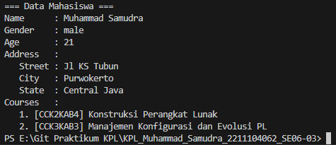
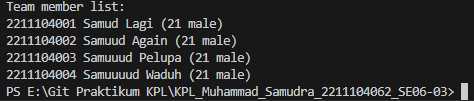
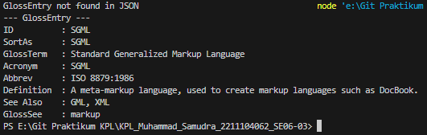

# JURNAL MODUL 7
<big> **Nama: Muhammad Samudra** </big> 
<big> **NIM: 2211104062** </big>

---
### Deserialization 1
Di sini kita ditugaskan untuk melakukan deserialization pada file `jurnal7_1_2211104062.json` yang berisikan data mahasiswa (sendiri). 

file .json: `jurnal7_1_2211104062.json`
```js
{
   "firstName": "Muhammad",
   "lastName": "Samudra",
   "gender": "male",
   "age": 21,
   "address": {
       "streetAddress": "Jl KS Tubun",
       "city": "Purwokerto",
       "state": "Central Java"
   },
   "courses": [
       { "code": "CCK2KAB4", "name": "Konstruksi Perangkat Lunak" },
       { "code": "CCK3KAB3", "name": "Manajemen Konfigurasi dan Evolusi PL" }
   ]
}
```
file class untuk melakukan parsing: `DataMahasiswa2211104062.js` 
```js
const fs = require('fs');

class DataMahasiswa {
    constructor(filePath) {
        this.filePath = filePath;
    }

    readJson() {
        try {
            const data = fs.readFileSync(this.filePath, 'utf-8');
            const json = JSON.parse(data);

            console.log("=== Data Mahasiswa ===");
            console.log(`Name      : ${json.firstName} ${json.lastName}`);
            console.log(`Gender    : ${json.gender}`);
            console.log(`Age       : ${json.age}`);
            console.log("Address   :");
            console.log(`   Street : ${json.address.streetAddress}`);
            console.log(`   City   : ${json.address.city}`);
            console.log(`   State  : ${json.address.state}`);
            console.log("Courses   :");

            json.courses.forEach((course, index) => {
                console.log(`   ${index + 1}. [${course.code}] ${course.name}`);
            });
        } catch (err) {
            console.error("Error reading JSON file:", err.message);
        }
    }
}

const reader = new DataMahasiswa('./07_Grammar-Based_Input_Processing_Parsing/Jurnal/jurnal7_1_2211104062.json');
reader.readJson();
```

File ini berisi method readJson() yang bertugas untuk mencari file .json. Lalu melakukan parsing Data Mahasiswa sesuai dengan format yang diinginkan. Lalu terakhir melakukan print data yang telah diparsing dan diformat.

**Output**


### Deserialization 2
Di sini kita ditugaskan untuk melakukan deserialization pada file `jurnal7_2_2211104062.json` yang berisikan data anggota kelompok (well)

File .json: `jurnal7_2_2211104062.json`
```js
{
   "members" : [
     {
        "firstName": "Samud",
        "lastName": "Lagi",
        "gender": "male",
        "age": 21,
        "nim": "2211104001"
     },
     {
        "firstName": "Samuud",
        "lastName": "Again",
        "gender": "male",
        "age": 21,
        "nim": "2211104002"
     },
     {
        "firstName": "Samuuud",
        "lastName": "Pelupa",
        "gender": "male",
        "age": 21,
        "nim": "2211104003"
     },
     {
       "firstName": "Samuuuud",
       "lastName": "Waduh",
       "gender": "male",
       "age": 21,
       "nim": "2211104004"
    }
   ]
 }
 ```

File class untuk parsing: `TeamMembers2211104062.js`
```js
{
   "members" : [
     {
        "firstName": "Samud",
        "lastName": "Lagi",
        "gender": "male",
        "age": 21,
        "nim": "2211104001"
     },
     {
        "firstName": "Samuud",
        "lastName": "Again",
        "gender": "male",
        "age": 21,
        "nim": "2211104002"
     },
     {
        "firstName": "Samuuud",
        "lastName": "Pelupa",
        "gender": "male",
        "age": 21,
        "nim": "2211104003"
     },
     {
       "firstName": "Samuuuud",
       "lastName": "Waduh",
       "gender": "male",
       "age": 21,
       "nim": "2211104004"
    }
   ]
 }
 ```
File mirip seperti file yang digunakan untuk melakukan deserialization 1 yang berisi method readJson() yang mencari, mem-parsing, dan mengeprint sesuai format. Bedanya dilakukan loop forEach() untuk setiap anggota member (sama seperti course di deserialization 1).

**Output**


### Deserialization 3
Di sini kita ditugaskan untuk melakukan deserialization pada file `jurnal7_3_2211104062.json` yang berisikan data 
item glossary. 

File .json: `jurnal7_3_2211104062.json`
```js
{
    "glossary": {
        "title": "example glossary",
		"GlossDiv": {
            "title": "S",
			"GlossList": {
                "GlossEntry": {
                    "ID": "SGML",
					"SortAs": "SGML",
					"GlossTerm": "Standard Generalized Markup Language",
					"Acronym": "SGML",
					"Abbrev": "ISO 8879:1986",
					"GlossDef": {
                        "para": "A meta-markup language, used to create markup languages such as DocBook.",
						"GlossSeeAlso": ["GML", "XML"]
                    },
					"GlossSee": "markup"
                }
            }
        }
    }
}
```

File untuk parsing: `GlossaryItem2211104062.js`
```js
const fs = require('fs');

class GlossaryItem {
  constructor(filePath) {
    this.filePath = filePath;
  }

  readJson() {
    try {
      const data = fs.readFileSync(this.filePath, 'utf8');
      const jsonData = JSON.parse(data);

      const glossEntry = jsonData.glossary?.GlossDiv?.GlossList?.GlossEntry;

      if (!glossEntry) {
        console.error('GlossEntry not found in JSON');
        return;
      }

      console.log('--- GlossEntry ---');
      console.log(`ID          : ${glossEntry.ID}`);
      console.log(`SortAs      : ${glossEntry.SortAs}`);
      console.log(`GlossTerm   : ${glossEntry.GlossTerm}`);
      console.log(`Acronym     : ${glossEntry.Acronym}`);
      console.log(`Abbrev      : ${glossEntry.Abbrev}`);
      console.log(`Definition  : ${glossEntry.GlossDef.para}`);
      console.log(`See Also    : ${glossEntry.GlossDef.GlossSeeAlso.join(', ')}`);
      console.log(`GlossSee    : ${glossEntry.GlossSee}`);
    } catch (err) {
      console.error('Error reading or parsing the JSON file:', err.message);
    }
  }
}

const reader = new GlossaryItem('./07_Grammar-Based_Input_Processing_Parsing/Jurnal/jurnal7_3_2211104062.json');
reader.readJson();
```

Lagi-lagi file ini berisi method readJson() untuk mencari, memparsing, dan memformat data yang ada di file .json, hanya saja kali ini karena data berada lebih dalam sehingga harus dicari dulu glossEntry, di mana data terletak.

**Output**



