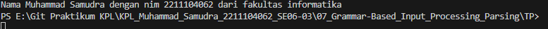

# TP MODUL 7
### Nama: Muhammad Samudra
### NIM: 2211104062

---
### Deserializaton 1
`tp7_1_2211104062.json`
```
{
    "nama": {
        "depan": "Muhammad",
        "belakang": "Samudra"
    },
    "nim": 2211104062,
    "fakultas": "informatika"
}
```

`DataMahasiswa_2211104062.js`
```
const fs = require('fs');

class Mahasiswa {
  constructor(namaDepan, namaBelakang, nim, fakultas) {
    this.namaDepan = namaDepan;
    this.namaBelakang = namaBelakang;
    this.nim = nim;
    this.fakultas = fakultas;
  }

  static readJSON(filePath) {
    fs.readFile(filePath, 'utf8', (err, data) => {
      if (err) {
        console.error('Gagal membaca file:', err);
        return;
      }

      try {
        const jsonData = JSON.parse(data);
        const mahasiswa = new Mahasiswa(
          jsonData.nama.depan,
          jsonData.nama.belakang,
          jsonData.nim,
          jsonData.fakultas
        );

        console.log(`Nama ${mahasiswa.namaDepan} ${mahasiswa.namaBelakang} dengan nim ${mahasiswa.nim} dari fakultas ${mahasiswa.fakultas}`);
      } catch (parseError) {
        console.error('Gagal mem-parsing JSON:', parseError);
      }
    });
  }
}


Mahasiswa.readJSON('tp7_1_2211104062.json');

// ./07_Grammar-Based_Input_Processing_Parsing/TP/tp7_1_2211104062.json
```

**Output**


Method `ReadJSON()` berfungsi untuk parsing file, terutama file `tp7_1_2211104062.json` agar menjadi objek yang sesuai, lalu melakukan print dengan format yang sesuai juga.

### Deserializaton 2
`tp7_2_2211104062.json`
```
{
	"courses": [
		{
			"code": "CCK2KAB4",
			"name": "Konstruksi Perangkat Lunak"
		},
		{
			"code": "CCK2LAB3",
			"name": "Kecerdasan Buatan"
		},
		{
			"code": "CCK2DAB3",
			"name": "Proses Perangkat Lunak"
		},
		{
			"code": "CCK2JAC2",
			"name": "Proyek Tingkat II"
		},
		{
			"code": "CCK3IAB2",
			"name": "Tata Tulis Ilmiah"
		},
		{
			"code": "CCK1LAB3",
			"name": "Design Thinking"
		},
		{
			"code": "CCK3KAB3",
			"name": "Manajemen Konfigurasi dan Evolusi PL"
		}
	]
}
```
`KuliahMahasiswa_2211104062.js`
```
const fs = require('fs');

class CourseReader {
  static readJson(filePath) {
    try {
      const data = fs.readFileSync(filePath, 'utf-8');
      const jsonData = JSON.parse(data);
      
      const courses = jsonData.courses;
      console.log("Daftar mata kuliah yang diambil:");
      courses.forEach((course, index) => {
        console.log(`MK ${index + 1} ${course.code} - ${course.name}`);
      });
    } catch (err) {
      console.error("Gagal membaca atau memproses file JSON:", err.message);
    }
  }
}

CourseReader.readJson('./07_Grammar-Based_Input_Processing_Parsing/TP/tp7_2_2211104062.json');

// ./07_Grammar-Based_Input_Processing_Parsing/TP/tp7_2_2211104062.json
```
Sama seperti di Deserialization 1, kode ini untuk membaca dan memparsing file .json, kali ini untuk membaca `tp2_2211104062.json`, lalu mengeprint isinya dengan formating yang sesuai.