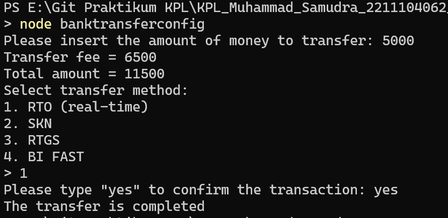
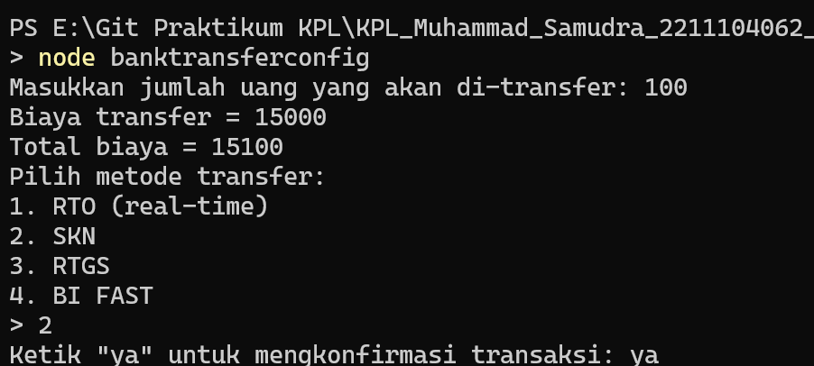
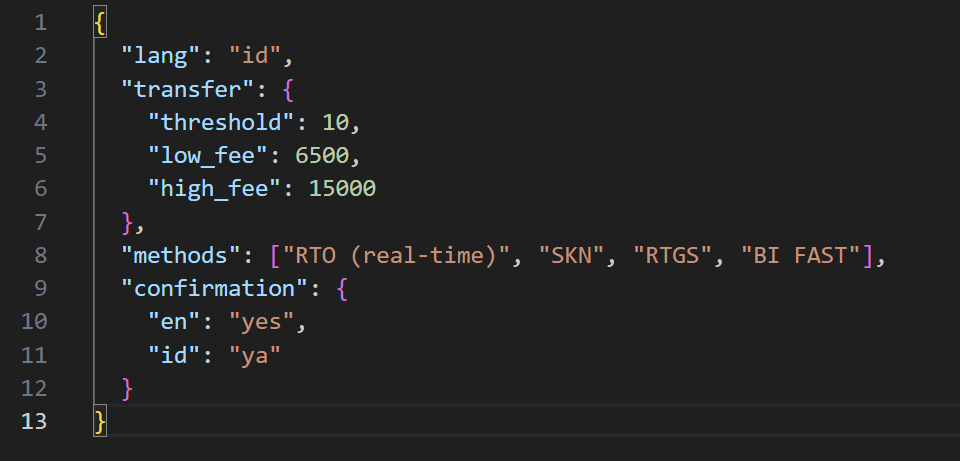

# TP MODUL 8
<big> **Nama: Muhammad Samudra** </big> 
<big> **NIM: 2211104062** </big>

---
**Program**

- file konfigurasi: `bank_transfer_config.json` (setelah diubah)
```json
{
  "lang": "id",
  "transfer": {
    "threshold": 10,
    "low_fee": 6500,
    "high_fee": 15000
  },
  "methods": ["RTO (real-time)", "SKN", "RTGS", "BI FAST"],
  "confirmation": {
    "en": "yes",
    "id": "ya"
  }
}
```

- file runtime implementation: `BankTransferConfig.js`
```js
const fs = require('fs');
const readline = require('readline');

// Class untuk load konfigurasi
class BankTransferConfig {
    constructor(configPath = 'bank_transfer_config.json') {
        this.configPath = configPath;
        this.defaultConfig = {
            lang: 'en',
            transfer: {
                threshold: 25000000,
                low_fee: 6500,
                high_fee: 15000
            },
            methods: ["RTO (real-time)", "SKN", "RTGS", "BI FAST"],
            confirmation: {
                en: "yes",
                id: "ya"
            }
        };
        this.config = this.loadConfig();
    }

    loadConfig() {
        try {
            if (fs.existsSync(this.configPath)) {
                const data = fs.readFileSync(this.configPath, 'utf-8');
                return JSON.parse(data);
            } else {
                return this.defaultConfig;
            }
        } catch (error) {
            console.error("Error loading config, using default.");
            return this.defaultConfig;
        }
    }

    getConfig() {
        return this.config;
    }
}

// Fungsi bantu untuk input user
function askQuestion(query) {
    return new Promise(resolve => rl.question(query, ans => resolve(ans)));
}

// Mulai program
const rl = readline.createInterface({
    input: process.stdin,
    output: process.stdout
});

async function main() {
    const config = new BankTransferConfig().getConfig();
    const lang = config.lang;
    const transfer = config.transfer;
    const methods = config.methods;
    const confirmation = config.confirmation;

    // Langkah 1: Input nominal transfer
    const msgInsertAmount = lang === 'en'
        ? 'Please insert the amount of money to transfer: '
        : 'Masukkan jumlah uang yang akan di-transfer: ';
    const inputAmount = await askQuestion(msgInsertAmount);
    const amount = parseInt(inputAmount);

    // Langkah 2: Hitung biaya dan total
    const fee = amount <= transfer.threshold ? transfer.low_fee : transfer.high_fee;
    const total = amount + fee;

    if (lang === 'en') {
        console.log(`Transfer fee = ${fee}`);
        console.log(`Total amount = ${total}`);
    } else {
        console.log(`Biaya transfer = ${fee}`);
        console.log(`Total biaya = ${total}`);
    }

    // Langkah 3: Pilih metode transfer
    const msgMethod = lang === 'en'
        ? 'Select transfer method:'
        : 'Pilih metode transfer:';
    console.log(msgMethod);
    methods.forEach((method, index) => {
        console.log(`${index + 1}. ${method}`);
    });
    await askQuestion('> '); // Dummy input untuk lanjut

    // Langkah 4: Konfirmasi
    const msgConfirm = lang === 'en'
        ? `Please type "${confirmation.en}" to confirm the transaction: `
        : `Ketik "${confirmation.id}" untuk mengkonfirmasi transaksi: `;
    const inputConfirm = await askQuestion(msgConfirm);

    const isConfirmed = (lang === 'en' && inputConfirm === confirmation.en) ||
                        (lang === 'id' && inputConfirm === confirmation.id);

    if (isConfirmed) {
        console.log(lang === 'en' ? 'The transfer is completed' : 'Proses transfer berhasil');
    } else {
        console.log(lang === 'en' ? 'Transfer is cancelled' : 'Transfer dibatalkan');
    }

    rl.close();
}

main();
```

file ini membaca config dari file `bank_transfer_config.json` tetapi memiliki nilai default jika file .json hilang, tidak terbaca, dll.
file ini meminta input dari user dengan cara menampilkan pertanyaan agar user tahu apa yang harus diinput. 
file ini juga memiliki dua bahasa yang bisa diubah di menu lang di file `bank_transfer_config.json` dan akan mengubah tampilan program dan juga input yang diperlukan (dari `yes` menjadi `ya` ketika `lang=id`)

**Output**
secara default:


setelah mengubah file .json:


file .json yang diubah:


