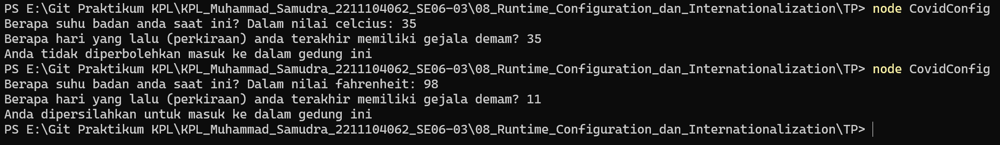

# TP MODUL 8
<big> **Nama: Muhammad Samudra** </big> 
<big> **NIM: 2211104062** </big>

---
### Covid_Convig
- File .json: `covid_config.json`
```json
{
  "satuan_suhu": "celcius",
  "batas_hari_deman": 14,
  "pesan_ditolak": "Anda tidak diperbolehkan masuk ke dalam gedung ini",
  "pesan_diterima": "Anda dipersilahkan untuk masuk ke dalam gedung ini"
}
```

- File Runtime Configuration: `CovidConfig.js`
```js
const fs = require('fs');
const readline = require('readline');

// Class CovidConfig
class CovidConfig {
  constructor(configPath = 'covid_config.json') {
    this.configPath = configPath;
    this.defaultConfig = {
      satuan_suhu: 'celcius',
      batas_hari_deman: 14,
      pesan_ditolak: 'Anda tidak diperbolehkan masuk ke dalam gedung ini',
      pesan_diterima: 'Anda dipersilahkan untuk masuk ke dalam gedung ini',
    };
    this.config = this.loadConfig();
  }

  loadConfig() {
    if (fs.existsSync(this.configPath)) {
      try {
        const rawData = fs.readFileSync(this.configPath);
        const parsedData = JSON.parse(rawData);
        return { ...this.defaultConfig, ...parsedData };
      } catch (err) {
        console.error("Gagal membaca konfigurasi. Menggunakan konfigurasi default.");
        return this.defaultConfig;
      }
    } else {
      return this.defaultConfig;
    }
  }

  saveConfig() {
    fs.writeFileSync(this.configPath, JSON.stringify(this.config, null, 2));
  }

  getConfig() {
    return this.config;
  }

  UbahSatuan() {
    this.config.satuan_suhu = this.config.satuan_suhu === 'celcius' ? 'fahrenheit' : 'celcius';
    this.saveConfig();
  }
}

// Program Utama
(async () => {
  const covidConfig = new CovidConfig();
  covidConfig.UbahSatuan();

  const config = covidConfig.getConfig();

  const rl = readline.createInterface({
    input: process.stdin,
    output: process.stdout
  });

  const ask = (question) => {
    return new Promise((resolve) => {
      rl.question(question, (answer) => resolve(answer));
    });
  };

  const suhu = parseFloat(await ask(`Berapa suhu badan anda saat ini? Dalam nilai ${config.satuan_suhu}: `));
  const hariDemam = parseInt(await ask(`Berapa hari yang lalu (perkiraan) anda terakhir memiliki gejala demam? `), 10);

  rl.close();

  // Validasi suhu
  let suhuValid = false;
  if (config.satuan_suhu === 'celcius') {
    suhuValid = suhu >= 36.5 && suhu <= 37.5;
  } else if (config.satuan_suhu === 'fahrenheit') {
    suhuValid = suhu >= 97.7 && suhu <= 99.5;
  }

  // Validasi hari demam
  const hariValid = hariDemam < config.batas_hari_deman;

  if (suhuValid && hariValid) {
    console.log(config.pesan_diterima);
  } else {
    console.log(config.pesan_ditolak);
  }
})();
```

Program ini membaca konfigurasi dari file `covid_config.json`. Lalu mengambil input dari user dengan menampilkan pertanyaan “Berapa suhu badan anda saat ini?" dan “Berapa hari yang lalu (perkiraan) anda terakhir memiliki gejala deman?” lalu mengambil input dari user. Dari input itu dicek apakah sesuai kriteria dan terakhir mengeprint jawaban dari sistem apakah user diperbolehkan masuk.

**Output**



