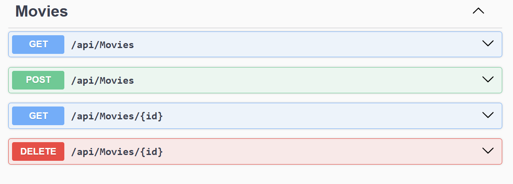
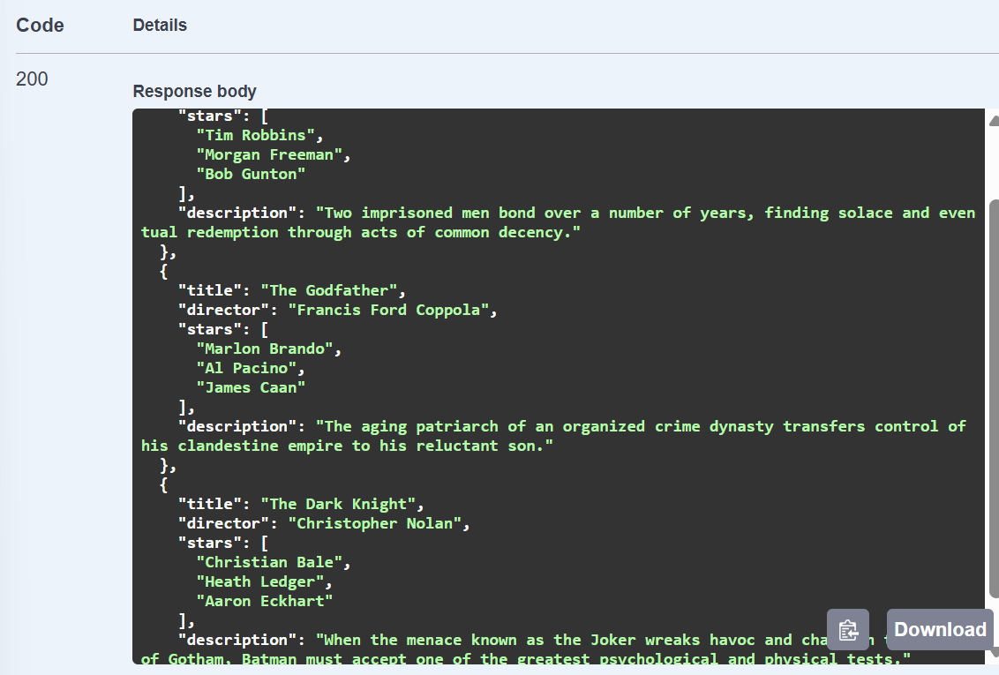
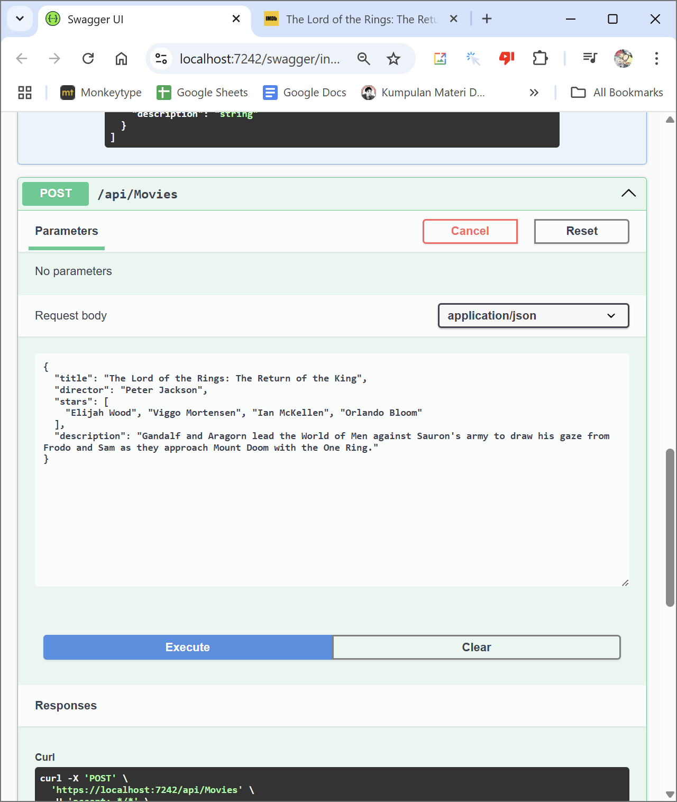
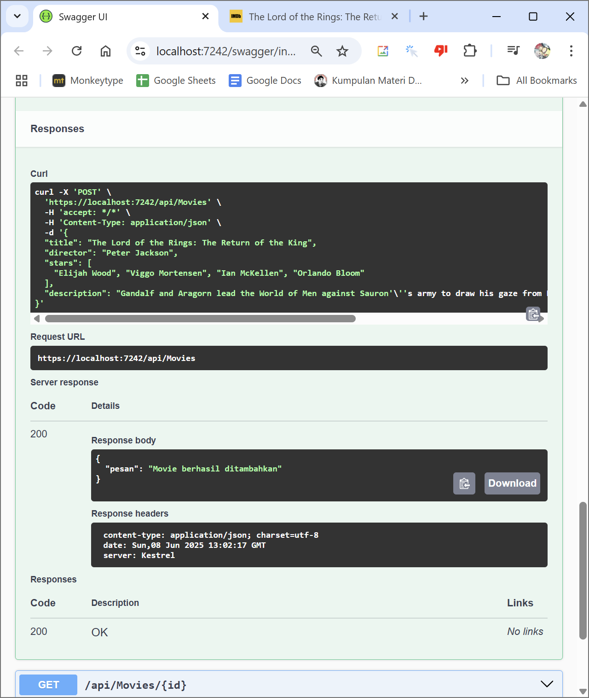
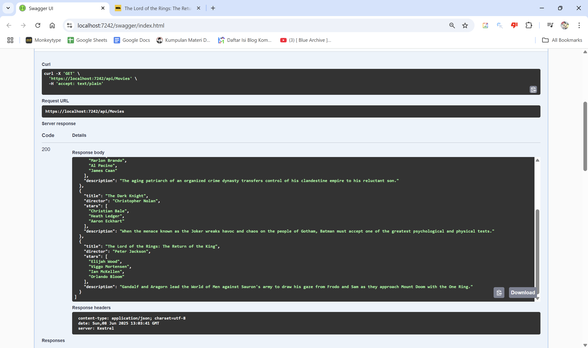
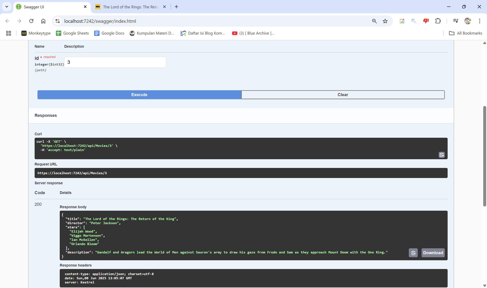
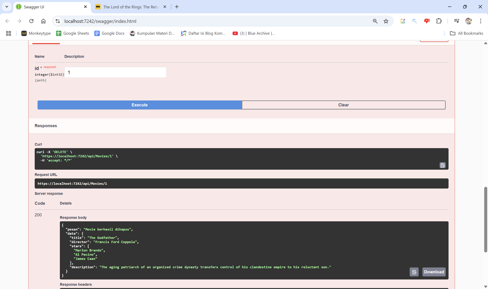

# TP MODUL 9
<big> **Nama: Muhammad Samudra** </big> 
<big> **NIM: 2211104062** </big>

---
### Tugas Jurnal 1
Buat program Web API sesuai spesifikasi:

- File Model `Movies.cs`:
```cs
using System.Collections.Generic;

namespace MovieApi.Models
{
    public class Movie
    {
        public string Title { get; set; }
        public string Director { get; set; }
        public List<string> Stars { get; set; }
        public string Description { get; set; }
    }
}
```
File berada di `.\modul9_2211104062\modul9_2211104062\Movies.cs`

- File Controller `MoviesController.cs`:
```cs
using Microsoft.AspNetCore.Mvc;
using System.Collections.Generic;
using MovieApi.Models;

namespace MovieApi.Controllers
{
    [ApiController]
    [Route("api/[controller]")]
    public class MoviesController : ControllerBase
    {
        public static List<Movie> MovieList = new List<Movie>
        {
            new Movie
            {
                Title = "The Shawshank Redemption",
                Director = "Frank Darabont",
                Stars = new List<string> { "Tim Robbins", "Morgan Freeman", "Bob Gunton" },
                Description = "Two imprisoned men bond over a number of years, finding solace and eventual redemption through acts of common decency."
            },
            new Movie
            {
                Title = "The Godfather",
                Director = "Francis Ford Coppola",
                Stars = new List<string> { "Marlon Brando", "Al Pacino", "James Caan" },
                Description = "The aging patriarch of an organized crime dynasty transfers control of his clandestine empire to his reluctant son."
            },
            new Movie
            {
                Title = "The Dark Knight",
                Director = "Christopher Nolan",
                Stars = new List<string> { "Christian Bale", "Heath Ledger", "Aaron Eckhart" },
                Description = "When the menace known as the Joker wreaks havoc and chaos on the people of Gotham, Batman must accept one of the greatest psychological and physical tests."
            }
        };

        [HttpGet]
        public ActionResult<List<Movie>> GetAllMovies()
        {
            return MovieList;
        }

        [HttpGet("{id}")]
        public ActionResult<Movie> GetMovieById(int id)
        {
            if (id >= 0 && id < MovieList.Count)
            {
                return MovieList[id];
            }
            return NotFound(new { error = "Movie tidak ditemukan" });
        }

        [HttpPost]
        public ActionResult AddMovie([FromBody] Movie movie)
        {
            MovieList.Add(movie);
            return Ok(new { pesan = "Movie berhasil ditambahkan" });
        }

        [HttpDelete("{id}")]
        public ActionResult DeleteMovie(int id)
        {
            if (id >= 0 && id < MovieList.Count)
            {
                var deleted = MovieList[id];
                MovieList.RemoveAt(id);
                return Ok(new { pesan = "Movie berhasil dihapus", data = deleted });
            }
            return NotFound(new { error = "Movie tidak ditemukan" });
        }
    }
}
```
File berada di `.\modul9_2211104062\modul9_2211104062\Controllers\MoviesController.cs`

Tampilan di swagger UI:


Ketika mencoba GET atau mengambil data film akan didapat output seperti berikut:


Menambahkan Movie menggunakan bagian POST:


terlihat data berhasil ditambahkan

Lalu kita bisa mengecek kembali apakah movie sudah ditambahkan dengan mengambil data movies lagi:


Setelah itu kita akan mencoba mengambil data menggunakan opsi ketiga, yaitu GET {id}, bedanya opsi ini hanya mengambil data sesuai dengan index yang diminta (id):



Terakhir kita akan mencoba menghapus dengan DELETE. Di sini saya akan mencoba menghapus movie dengan index 1, atau dengan kata lain item kedua:



Jangan lupa untuk mengecek apakah item benar-benar terhapus:


Terlihat di sini film Godfather tidak ada berarti berhasil terhapus


