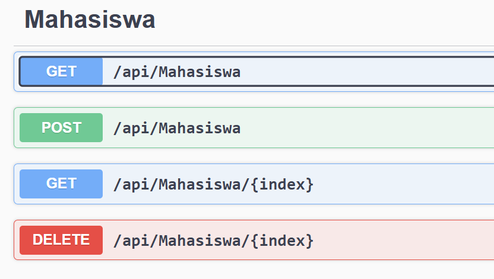
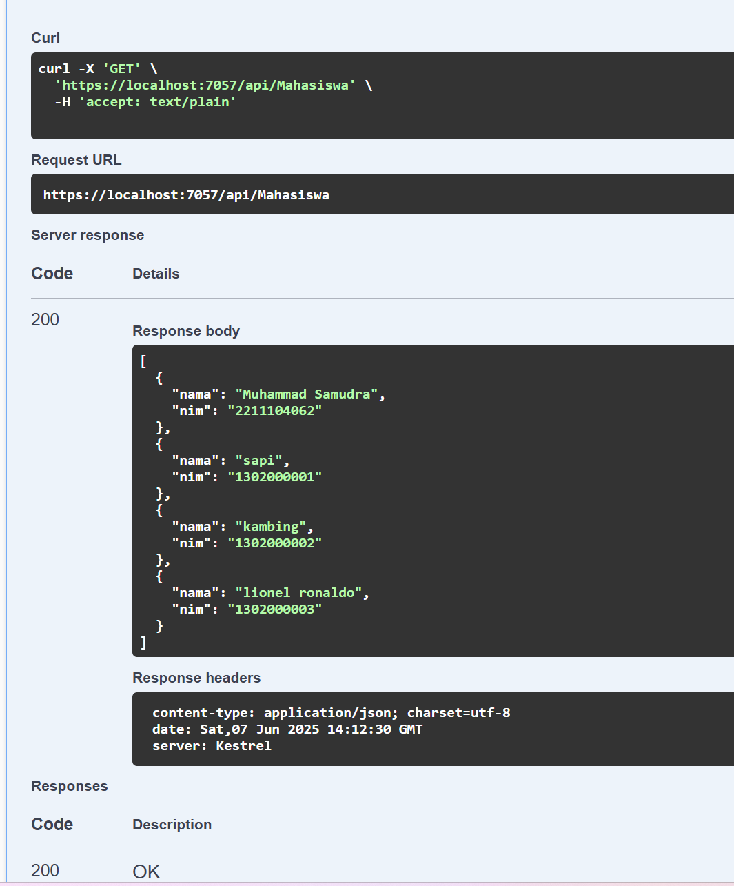
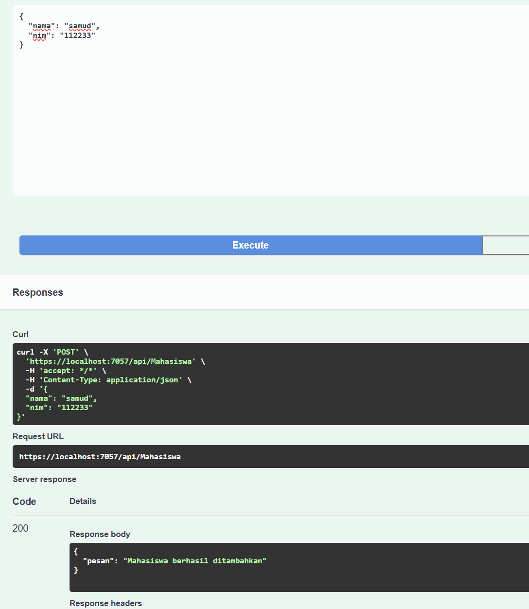
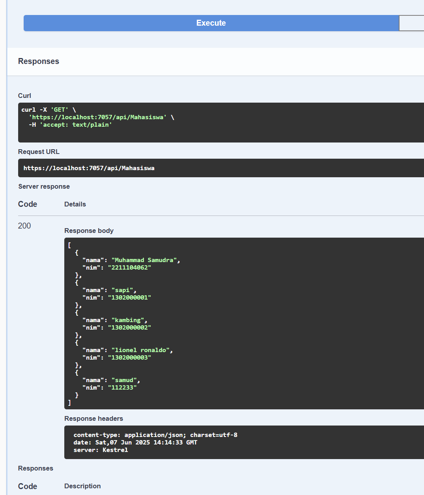
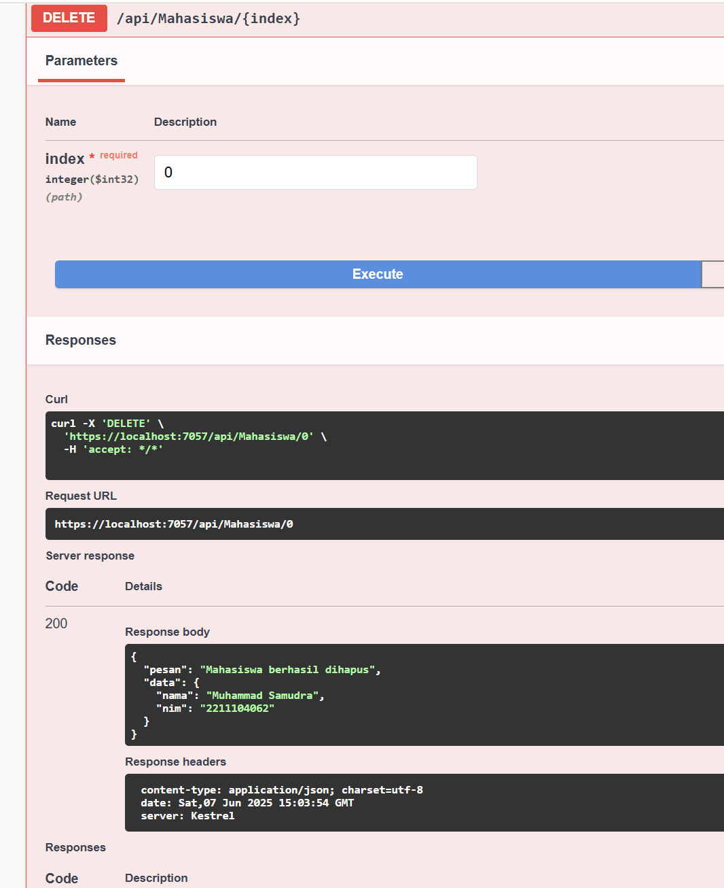
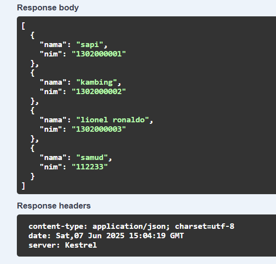

# TP MODUL 9
<big> **Nama: Muhammad Samudra** </big> 
<big> **NIM: 2211104062** </big>

---
### Project Web API
Pertama buat project baru di Visual Studio dengan template yang sesuai, lalu coba run dahulu untuk mengecek. Jika berhasil terarahkan ke swagger maka baru mulai membuat kode.

File Model `Mahasiswa.cs`:
```cs
namespace MahasiswaAPI.Models
{
    public class Mahasiswa
    {
        public string Nama { get; set; }
        public string Nim { get; set; }
    }
}
```

File Controller `MahasiswaController.cs`:
```cs
using Microsoft.AspNetCore.Mvc;
using MahasiswaAPI.Models;
using System.Collections.Generic;

namespace MahasiswaAPI.Controllers
{
    [ApiController]
    [Route("api/[controller]")]
    public class MahasiswaController : ControllerBase
    {
        private static List<Mahasiswa> mahasiswaList = new List<Mahasiswa>
        {
            new Mahasiswa { Nama = "Muhammad Samudra", Nim = "2211104062" },
            new Mahasiswa { Nama = "sapi", Nim = "1302000001" },
            new Mahasiswa { Nama = "kambing", Nim = "1302000002" },
            new Mahasiswa { Nama = "lionel ronaldo", Nim = "1302000003" }
        };

        [HttpGet]
        public ActionResult<List<Mahasiswa>> GetAll()
        {
            return mahasiswaList;
        }

        [HttpGet("{index}")]
        public ActionResult<Mahasiswa> Get(int index)
        {
            if (index >= 0 && index < mahasiswaList.Count)
                return mahasiswaList[index];
            return NotFound(new { error = "Index tidak ditemukan" });
        }

        [HttpPost]
        public ActionResult Tambah(Mahasiswa mhs)
        {
            mahasiswaList.Add(mhs);
            return Ok(new { pesan = "Mahasiswa berhasil ditambahkan" });
        }

        [HttpDelete("{index}")]
        public ActionResult Hapus(int index)
        {
            if (index >= 0 && index < mahasiswaList.Count)
            {
                var deleted = mahasiswaList[index];
                mahasiswaList.RemoveAt(index);
                return Ok(new { pesan = "Mahasiswa berhasil dihapus", data = deleted });
            }
            return NotFound(new { error = "Index tidak ditemukan" });
        }
    }
}
```

Jalankan ulang kembali projek di VS, lalu di swagger akan menjadi seperti ini:


Kita akan mencoba opsi pertama (GET), mengambil data Mahasiswa:


Perbedaan GET dari opsi 1 dan opsi 3 adalah opsi 1 mengambil semua sementara opsi 3 hanya mengambil objek berdasarkan index yang dipilih.

Lalu kita akan mencoba POST untuk menambahkan data mahasiswa:


Di sini terdapat pesan penambahan telah berhasil, kita coba mengambil kembali data mahasiswa:



Terlihat data yang kita tambahkan sebelumnya berhasil tertambah.

Sekarang kita coba untuk menghapus data, disini saya memilih untuk menghapus data dengan index 0 yaitu mahasiswa bernama `Muhammad Samudra`


Kita lihat lagi dengan mengambil semua data, terlihat tidak ada data dengan nama bernilai `Muhammad Samudra`




