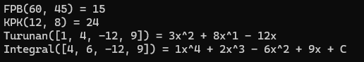

# TP MODUL 10
<big> **Nama: Muhammad Samudra** </big> 
<big> **NIM: 2211104062** </big>

---

### Program
`MatematikaLibraries/Class1.cs`
```cs
using System;

namespace MatematikaLibraries
{
    public static class Matematika
    {
        // A. FPB
        public static int FPB(int input1, int input2)
        {
            while (input2 != 0)
            {
                int temp = input2;
                input2 = input1 % input2;
                input1 = temp;
            }
            return input1;
        }

        // B. KPK
        public static int KPK(int input1, int input2)
        {
            return (input1 * input2) / FPB(input1, input2);
        }

        // C. Turunan
        public static string Turunan(int[] persamaan)
        {
            string hasil = "";
            int pangkat = persamaan.Length - 1;

            for (int i = 0; i < persamaan.Length - 1; i++)
            {
                int koef = persamaan[i] * pangkat;
                if (koef == 0)
                {
                    pangkat--;
                    continue;
                }

                string term = (koef > 0 && hasil != "") ? $" + {koef}" : (koef < 0 ? $" - {Math.Abs(koef)}" : $"{koef}");
                term += (pangkat - 1 > 0) ? $"x^{pangkat - 1}" :
                        (pangkat - 1 == 0 ? "x" : "");
                hasil += term;

                pangkat--;
            }

            return hasil;
        }

        // D. Integral
        public static string Integral(int[] persamaan)
        {
            string hasil = "";
            int pangkat = persamaan.Length;

            for (int i = 0; i < persamaan.Length; i++)
            {
                int pembilang = persamaan[i];
                int penyebut = pangkat;
                double hasilBagi = (double)pembilang / penyebut;

                string formatted = hasilBagi % 1 == 0 ? $"{(int)hasilBagi}" : $"{hasilBagi:0.##}";
                string term = (hasil != "" && hasilBagi > 0) ? $" + {formatted}" : (hasilBagi < 0 ? $" - {formatted.TrimStart('-')}" : $"{formatted}");

                term += pangkat == 1 ? "x" : $"x^{pangkat}";
                hasil += term;

                pangkat--;
            }

            hasil += " + C";
            return hasil;
        }
    }
}
```
Project ini adalah library yang berisi fungsi-fungsi yang diminta, ada FPB(), KPK(), Turunan(), Integral().

`TesMatematika/program.cs`
```cs
using System;
using MatematikaLibraries;

namespace TesMatematika
{
    class Program
    {
        static void Main(string[] args)
        {
            Console.WriteLine("FPB(60, 45) = " + Matematika.FPB(60, 45));
            Console.WriteLine("KPK(12, 8) = " + Matematika.KPK(12, 8));

            Console.WriteLine("Turunan([1, 4, -12, 9]) = " + Matematika.Turunan(new int[] { 1, 4, -12, 9 }));
            Console.WriteLine("Integral([4, 6, -12, 9]) = " + Matematika.Integral(new int[] { 4, 6, -12, 9 }));
        }
    }
}
```
Sementara project ini adalah aplikasi console untuk menjalankan dan mengetes library MatematikaLibraries. Di sini lah dilakukan input nilai dan juga fungsi-fungsi dipanggil.

### Penjelasan Singkat Program
1. FPB(): Menggunakan algoritma Euclid untuk mencari FPB, dengan pengurangan berulang dan modulo.
2. KPK(): Menggunakan rumus `KPK = (input1 × input2) / FPB(input1, input2)`, yang berarti fungsi FPB() dipanggil untuk mencari KPK
3. Turunan(): Pertama mencari pasangan pangkat x dengan koefisien. Lalu kita mengkalikan koefisien dengan pangkat tersebut, lalu mengurangi pangkat dengan 1 pindah ke koefisien selanjutnya.
4. Integral(): Sama seperti turunan, tetapi nilai koefisien baru dibagi dengan nilai pangkat lama. Loop bergerak dengan pangkat menurun tetapi sebelum nilai pangkat dikurangi, dioutput dahulu dengan nilai pangkat ditambah satu sehingga hasil sesuai.

### Output
