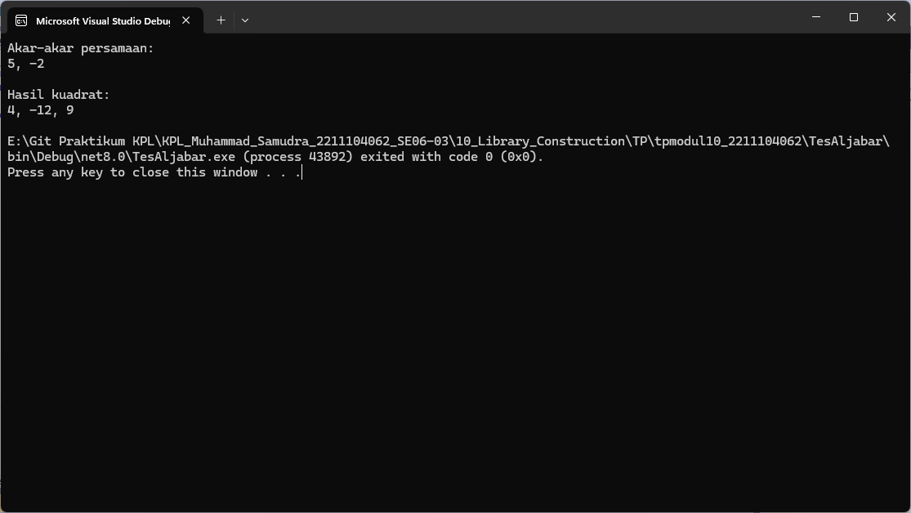

# TP MODUL 10
<big> **Nama: Muhammad Samudra** </big> 
<big> **NIM: 2211104062** </big>

---
### Program
`AljabarLibraries/Aljabar.cs`:
```cs
using System;

namespace AljabarLibraries
{
    public class Aljabar
    {
        public static double[] AkarPersamaanKuadrat(double[] persamaan)
        {
            double a = persamaan[0];
            double b = persamaan[1];
            double c = persamaan[2];

            double diskriminan = b * b - 4 * a * c;
            if (diskriminan < 0) return new double[] { };

            double akar1 = (-b + Math.Sqrt(diskriminan)) / (2 * a);
            double akar2 = (-b - Math.Sqrt(diskriminan)) / (2 * a);
            return new double[] { akar1, akar2 };
        }

        public static double[] HasilKuadrat(double[] persamaan)
        {
            double a = persamaan[0];
            double b = persamaan[1];

            double a2 = a * a;
            double ab2 = 2 * a * b;
            double b2 = b * b;

            return new double[] { a2, ab2, b2 };
        }
    }
}

```
Ini adalah library untuk menyimpan fungsi aljabarnya

`TesAljabar/Program.cs`:
```cs
using System;
using AljabarLibraries;

namespace TesAljabar
{
    class Program
    {
        static void Main(string[] args)
        {
            // Contoh 1: Akar dari persamaan kuadrat x^2 - 3x - 10 = 
            double[] akar = Aljabar.AkarPersamaanKuadrat(new double[]{ 1, -3, -10 });
            Console.WriteLine("Akar-akar persamaan:");
            Console.WriteLine($"{akar[0]}, {akar[1]}");


            // Contoh 2: Hasil kuadrat dari 2x - 
            double[] hasil = Aljabar.HasilKuadrat(new double[] { 2, -3 });
            Console.WriteLine("\nHasil kuadrat:");
            Console.WriteLine($"{hasil[0]}, {hasil[1]}, {hasil[2]}");
        }
    }
}
```
Sementara ini berguna sebagai executable program, berisi pemanggilan fungsi dan input.

### Output



