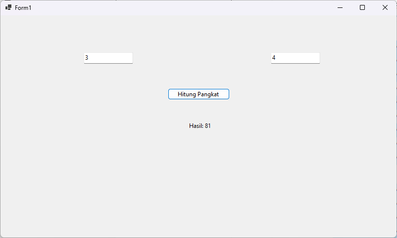
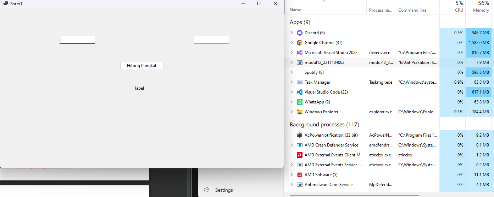
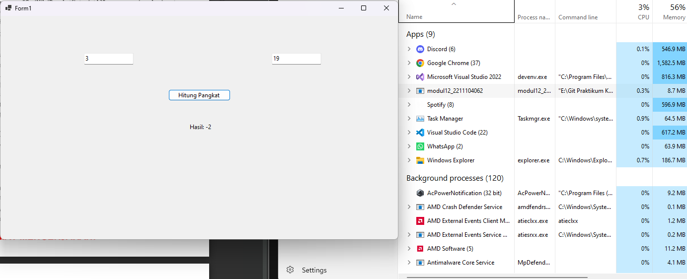
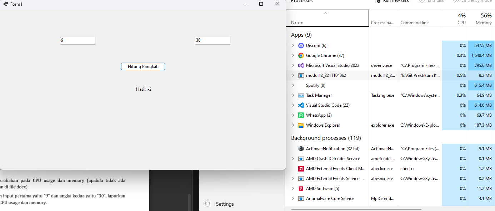
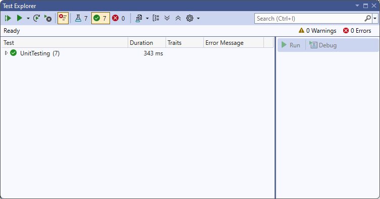

# TP MODUL 12
<big> **Nama: Muhammad Samudra** </big> 
<big> **NIM: 2211104062** </big>

---

### Membuat GUI Sederhana 
1. Buat Solution di Visual Studio dengan template Windows Form dan beri nama modul12_2211104062
2. Beri dua buah textbox, satu button dan satu label
3. Isi Form1.cs dengan kode berikut:
```cs
using System;
using System.Windows.Forms;

namespace modul12_2211104062
{
    public partial class Form1 : Form
    {
        public Form1()
        {
            InitializeComponent();
        }

        public static int CariNilaiPangkat(int a, int b)
        {
            if (b == 0)
                return 1;
            if (b < 0)
                return -1;
            if (b > 10 || a > 100)
                return -2;

            try
            {
                checked
                {
                    int hasil = 1;
                    for (int i = 0; i < b; i++)
                    {
                        hasil *= a;
                    }
                    return hasil;
                }
            }
            catch (OverflowException)
            {
                return -3;
            }
        }

        private void buttonHitung_Click(object sender, EventArgs e)
        {
            int a, b;
            if (int.TryParse(textBoxA.Text, out a) && int.TryParse(textBoxB.Text, out b))
            {
                int hasil = CariNilaiPangkat(a, b);
                labelHasil.Text = "Hasil: " + hasil.ToString();
            }
            else
            {
                labelHasil.Text = "Input tidak valid!";
            }
        }

        //private void buttonHitung_Click(object sender, EventArgs e)
        //{
        //    labelHasil.Text = "Tombol ditekan!";
        //} //buat debug tadi

        private void labelHasil_Click(object sender, EventArgs e)
        {

        }

        private void Form1_Load(object sender, EventArgs e)
        {

        }
    }
}
```
4. Begini tampilan program:


### Melakukan Software Profiling
Jalankan Solution dan cek resource yang digunakan di task manager
- Ketika program belum diberi input:

program menggunakan 0% cpu dan 7.9 MB memory
- Ketika program diberi input 3 dan 9 lalu di klik buttonnya:

Program menggunakan 0.3% cpu dan 8.7MB memory
- Ketika program diberi input 9 dan 30 lalu di klik buttonnya:

Program menggunakan 0.5% cpu dan 8.2MB memory

Program memakai semakin banyak jika input semakin besar tetapi pemakaian memory paling banyak di input menengah daripada input tertinggi

### Menambahkan Unit Testing
1. Buat project baru di solution ini menggunakan template MSTest Test Project
2. Add Project Reference di project ini ke project program GUI yang telah dibuat
3. Tambahkan kode berikut ke Test1.cs:
```cs
using Microsoft.VisualStudio.TestTools.UnitTesting;
using modul12_2211104062;

namespace UnitTesting
{
    [TestClass]
    public class CariNilaiPangkatTests
    {
        [TestMethod]
        public void NormalCase_2Pangkat3_Hasil8()
        {
            Assert.AreEqual(8, Form1.CariNilaiPangkat(2, 3));
        }

        [TestMethod]
        public void B_Zero_Hasil1()
        {
            Assert.AreEqual(1, Form1.CariNilaiPangkat(10, 0));
        }

        [TestMethod]
        public void AB_Zero_Hasil1()
        {
            Assert.AreEqual(1, Form1.CariNilaiPangkat(0, 0));
        }

        [TestMethod]
        public void B_Negatif_HasilMinus1()
        {
            Assert.AreEqual(-1, Form1.CariNilaiPangkat(2, -1));
        }

        [TestMethod]
        public void A_Lebih100_HasilMinus2()
        {
            Assert.AreEqual(-2, Form1.CariNilaiPangkat(101, 3));
        }

        [TestMethod]
        public void B_Lebih10_HasilMinus2()
        {
            Assert.AreEqual(-2, Form1.CariNilaiPangkat(3, 11));
        }

        [TestMethod]
        public void Overflow_Cek_HasilMinus3()
        {
            Assert.AreEqual(-3, Form1.CariNilaiPangkat(99, 9)); 
        }
    }
}
```

Berikut hasilnya:


Berikut detail tentang test yang dilakukan:


| No | Input `(a, b)` | Ekspektasi | Penjelasan                                           | Branch yang diuji                              |
| -- | -------------- | ---------- | ---------------------------------------------------- | ---------------------------------------------- |
| 1  | `(2, 3)`       | `8`        | Menghitung 2^3 = 8 secara iterasi normal             | Jalur utama (tanpa kondisi if dan tanpa error) |
| 2  | `(10, 0)`      | `1`        | Karena `b == 0`, maka hasil selalu 1                 | `if (b == 0)`                                  |
| 3  | `(0, 0)`       | `1`        | Karena `a == b == 0` memiliki hasil 1 sesuai soal    | `if (a == b == 0)`                             |
| 4  | `(2, -1)`      | `-1`       | Karena `b < 0`, maka hasil -1                        | `if (b < 0)`                                   |
| 5  | `(101, 3)`     | `-2`       | Karena `a > 100`, maka hasil -2                      | `if (a > 100)`                                 |
| 6  | `(3, 11)`      | `-2`       | Karena `b > 10`, maka hasil -2                       | `if (b > 10)`                                  |
| 7  | `(99, 9)`      | `-3`       | Perkalian besar menyebabkan overflow pada tipe `int` | `catch (OverflowException)`                    |


