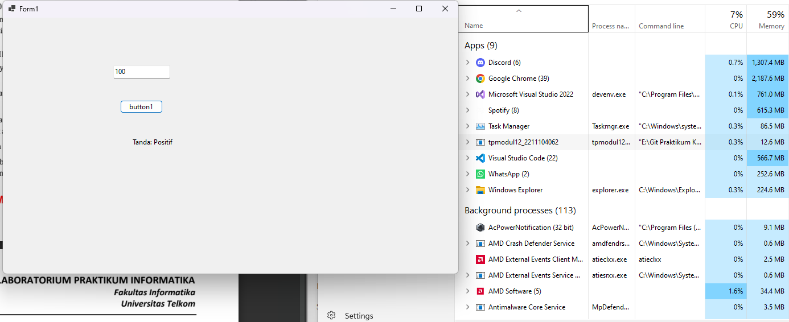

# TP MODUL 12
<big> **Nama: Muhammad Samudra** </big> 
<big> **NIM: 2211104062** </big>

---
### GUI Sederhana dan Software Profiling
1. Di visual Studio, buat project dengan template Windows Form
2. Drag texbox, button, dan label dari Toolbox
3. Isi Form1.cs menjadi berikut:
```cs
using System;
using System.Windows.Forms;

namespace tpmodul12_2211104062
{
    public partial class Form1 : Form
    {
        public Form1()
        {
            InitializeComponent();
        }

        // Method untuk menentukan tanda bilangan
        public string CariTandaBilangan(int a)
        {
            if (a < 0)
                return "Negatif";
            else if (a > 0)
                return "Positif";
            else
                return "Nol";
        }

        // Event saat tombol diklik
        private void button1_Click(object sender, EventArgs e)
        {
            int angka;
            if (int.TryParse(textBox1.Text, out angka))
            {
                string hasil = CariTandaBilangan(angka);
                label1.Text = "Tanda: " + hasil;
            }
            else
            {
                label1.Text = "Masukkan angka yang valid!";
            }
        }

        private void textBox1_TextChanged(object sender, EventArgs e)
        {
            // Boleh dikosongkan jika tidak digunakan
        }
    }
}
```
4. Save, build, dan jalankan solution. Buka juga Task Manager untuk memonitor resource yang terpakai:
    - Ketika textbox masih kosong:
    
    perhatikan tpmodul12_2211104062, pemakaian CPU 0% dan pemakaian memory 12.8MB

    - Ketika textbox sudah ada input dan button sudah ditekan:
    
    Sekarang pemakaian CPU naik 0.3% tetapi pemakaian memory turun 12.6MB, mungkin tidak ada perubahan signifikan dan hanya margin of error.
    

### Unit Testing
1. Buat project baru dengan template MSTest Test Project
2. Tambahkan Project Reference ke Project tpmodul12_2211104062
3. Isi Test1.cs dengan kode sebagai berikut:
```cs
using Microsoft.VisualStudio.TestTools.UnitTesting;
using tpmodul12_2211104062;  

namespace UnitTesting
{
    [TestClass]
    public class CariTandaBilanganTests
    {
        private Form1 form;

        [TestInitialize]
        public void Setup()
        {
            form = new Form1();
        }

        [TestMethod]
        public void TestNegatif()
        {
            var result = form.CariTandaBilangan(-5);
            Assert.AreEqual("Negatif", result);
        }

        [TestMethod]
        public void TestPositif()
        {
            var result = form.CariTandaBilangan(10);
            Assert.AreEqual("Positif", result);
        }

        [TestMethod]
        public void TestNol()
        {
            var result = form.CariTandaBilangan(0);
            Assert.AreEqual("Nol", result);
        }
    }
}
```
4. Save, build, lalu di menu run, ketik run all
5. Semua test berhasil:


Ketiga test ini berisi:
| Input | Expected Output | Status    |
| ----- | --------------- | ----------|
| -5    | "Negatif"       | ✅ Passed |
| 10    | "Positif"       | ✅ Passed |
| 0     | "Nol"           | ✅ Passed |


