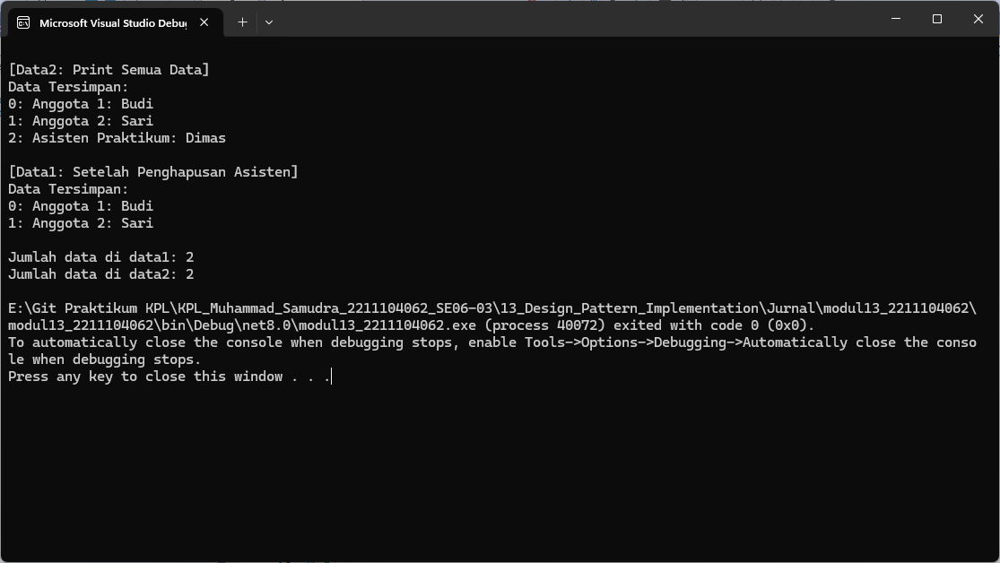

# JURNAL MODUL 13
<big> **Nama: Muhammad Samudra** </big> 
<big> **NIM: 2211104062** </big>

---
### Menjelaskan Design Pattern Singleton
Buka halaman web https://refactoring.guru/design-patterns/catalog kemudian baca design pattern dengan nama “Singleton”, dan jawab pertanyaan berikut ini (dalam Bahasa Indonesia):
A. Berikan salah dua contoh kondisi dimana design pattern “Singleton” dapat digunakan.
B. Berikan penjelasan singkat mengenai langkah-langkah dalam mengimplementasikan design pattern “Singleton”.
C. Berikan tiga kelebihan dan kekurangan dari design pattern “Singleton”.

**Jawab :**

**A. Dua contoh kondisi penggunaan Singleton:**
    1. Manajemen konfigurasi aplikasi (Configuration Manager)
    Saat aplikasi memerlukan akses konsisten ke pengaturan (misalnya file .ini atau .json) dari berbagai bagian kode, Singleton memastikan hanya ada satu objek konfigurasi, mencegah duplikasi dan inkonsistensi
    2. Logger pusat (Logging)
    Semua bagian aplikasi mengirimkan log ke satu sumber (misalnya file atau konsol). Dengan Singleton, semua modul menggunakan instance yang sama, sehingga format dan tujuan log tetap konsisten

**B. Langkah-langkah implementasi Singleton :**
1. Buat konstruktor private
Agar tidak ada kelas lain yang bisa membuat objek secara langsung.

2. Deklarasi variabel statis tunggal
Simpan instance tunggal di field static, misalnya private static Singleton instance;.

3. Sediakan metode akses global
Buat metode public staticgetInstance() atau properti Instance yang:

    - Jika instance masih null, buat objek baru.

    - Jika sudah ada, kembalikan instance yang ada.

4. (Opsional) Tambahkan thread-safety
Untuk mendukung akses paralel, gunakan mekanisme seperti:

    - Static initialization (C# static constructor) atau

    - Double‑checked locking dengan lock, volatile, atau

    - Lazy<T> di .NET untuk inisialisasi lambat dan aman

**C. Kelebihan dan Kekurangan Singleton :**
**Kelebihan**
1. Kontrol instans tunggal (Single instance)
Menjamin hanya satu objek yang dibuat sepanjang lifecycle aplikasi 

2. Akses global tersentralisasi
Instance dapat diakses dari mana saja tanpa perlu melewatkan referensi .

3. Inisialisasi malas (lazy initialization)
Objek hanya dibuat saat pertama kali dibutuhkan, sehingga menghemat sumber daya .

**Kekurangan**
1. Tercapainya global state → tight coupling
Singleton serupa variabel global, bisa memperlihatkan dependensi tersembunyi dan meningkatkan coupling 

2. Sulit di-unit-test
Karena sifat globalnya, sulit untuk mengganti dengan mock atau isolate saat testing 

3. Masalah thread & distribusi
Kalau tidak ditangani dengan benar untuk lingkungan multi-threaded, dapat menciptakan multiple instance atau perilaku tak terduga

### Implementasi Singleton
Pada Program.cs:
```cs
using System;
using System.Collections.Generic;

namespace modul13_2211104062
{
    // Singleton class
    public sealed class PusatDataSingleton
    {
        private static PusatDataSingleton _instance;

        // Property menyimpan data
        public List<string> DataTersimpan { get; set; }

        // Konstruktor private
        private PusatDataSingleton()
        {
            DataTersimpan = new List<string>(); // i. Konstruktor isi list kosong
        }

        // ii. Property singleton
        public static PusatDataSingleton GetDataSingleton()
        {
            if (_instance == null)
            {
                _instance = new PusatDataSingleton();
            }
            return _instance;
        }

        // iii. Mengembalikan seluruh data
        public List<string> GetSemuaData()
        {
            return DataTersimpan;
        }

        // iv. Print data satu per satu
        public void PrintSemuaData()
        {
            Console.WriteLine("Data Tersimpan:");
            for (int i = 0; i < DataTersimpan.Count; i++)
            {
                Console.WriteLine($"{i}: {DataTersimpan[i]}");
            }
        }

        // v. Menambahkan data ke list
        public void AddSebuahData(string input)
        {
            DataTersimpan.Add(input);
        }

        // vi. Menghapus data berdasarkan index
        public void HapusSebuahData(int index)
        {
            if (index >= 0 && index < DataTersimpan.Count)
            {
                DataTersimpan.RemoveAt(index);
            }
            else
            {
                Console.WriteLine("Index tidak valid!");
            }
        }
    }

    class Program
    {
        static void Main(string[] args)
        {
            // A. Buat dua variable data1 dan data2
            PusatDataSingleton data1;
            PusatDataSingleton data2;

            // B. Isi dengan GetDataSingleton()
            data1 = PusatDataSingleton.GetDataSingleton();
            data2 = PusatDataSingleton.GetDataSingleton();

            // C. Tambahkan data ke data1
            data1.AddSebuahData("Anggota 1: Budi");
            data1.AddSebuahData("Anggota 2: Sari");
            data1.AddSebuahData("Asisten Praktikum: Dimas");

            // D. Print lewat data2 (seharusnya data sama karena singleton)
            Console.WriteLine("\n[Data2: Print Semua Data]");
            data2.PrintSemuaData();

            // E. Hapus nama asisten dari data2
            data2.HapusSebuahData(2); // Hapus "Dimas" (index ke-2)

            // F. Cek hasil pada data1 (harusnya "Dimas" sudah tidak ada)
            Console.WriteLine("\n[Data1: Setelah Penghapusan Asisten]");
            data1.PrintSemuaData();

            // G. Cek jumlah elemen (seharusnya sama)
            Console.WriteLine($"\nJumlah data di data1: {data1.GetSemuaData().Count}");
            Console.WriteLine($"Jumlah data di data2: {data2.GetSemuaData().Count}");
        }

    }
}

```
1. **Class Singleton: `PusatDataSingleton`**

   * Memiliki atribut `DataTersimpan` berupa `List<string>` untuk menyimpan data.
   * Properti singleton `_instance` bertipe `PusatDataSingleton`.
   * Konstruktor `private` agar hanya bisa diakses lewat metode singleton.

2. **Metode-metenya:**

   * `GetDataSingleton()` mengembalikan instance tunggal (membuat jika belum ada).
   * `AddSebuahData(string)` menambahkan string ke list.
   * `HapusSebuahData(int)` menghapus data berdasarkan indeks.
   * `PrintSemuaData()` mencetak semua isi list ke konsol.
   * `GetSemuaData()` mengembalikan list yang tersimpan.

3. **`Main()`**

    - data1 dan data2 mengacu pada objek singleton yang sama.

    - Saat data1 menambahkan data, data2 juga melihat perubahan yang sama.

    - Setelah data2 menghapus "Dimas", maka data1 juga tidak bisa lagi melihat "Dimas".

    - Cetakan Count menunjukkan jumlah data sama persis di keduanya — bukti Singleton bekerja.

### Output


