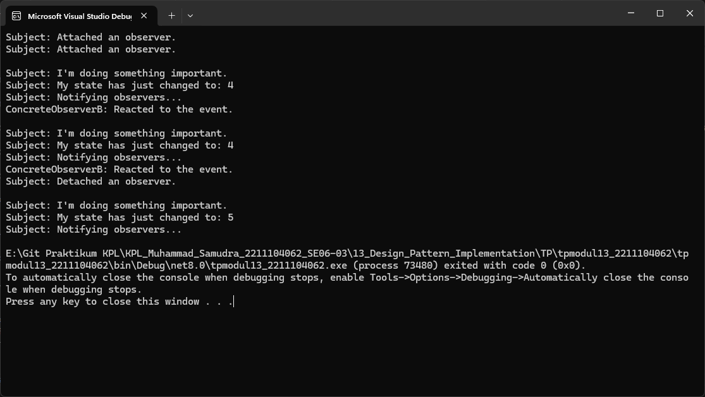

# TP MODUL 13
<big> **Nama: Muhammad Samudra** </big> 
<big> **NIM: 2211104062** </big>

---
### Pertanyaan
1. Salah satu contoh klasik adalah pada antarmuka GUI, misalnya ketika Anda membuat kelas Button khusus. Anda ingin klien bisa mendaftarkan kode khusus yang dipanggil saat tombol ditekan. Dengan menggunakan Observer, objek-objek listener bisa “subscribe” ke event tombol, sehingga ketika event terjadi (misalnya klik), semua listener yang terdaftar akan dipanggil tanpa perlu mengubah kode tombol itu sendiri
2. Berdasarkan Refactoring Guru , berikut urutannya:

    - Pisahkan logika bisnis menjadi dua bagian: bagian utama sebagai publisher, dan bagian lain sebagai subscriber.

    - Buat interface subscriber, biasanya minimal memiliki metode update() untuk menerima notifikasi.

    - Buat interface publisher, yang memiliki metode subscribe() dan unsubscribe() untuk mengelola daftar observers, serta notify() untuk mengirim update.

    - Implementasikan logika subscription, umumnya dalam kelas abstrak yang di­-extend oleh publisher, atau melalui komposisi jika tidak ingin ubah hierarki kelas.

    - Buat concrete publisher, yang saat terjadi kejadian penting memanggil notify() pada semua subscribers.

    - Buat concrete observers, yang mengimplementasikan metode update(), dan menerima data yang diperlukan (misalnya state terbaru).

    - Di sisi klien, buat objek subscriber, daftarkan ke publisher, sehingga ketika state berubah, subscriber akan otomatis dipanggil.

3. Kelebihan:
- Loose coupling: subject tidak tahu detail observer, cukup interface saja 

- Open/Closed Principle: Anda bisa menambahkan atau mengubah subscriber tanpa ubah publisher 

- Fleksibel: subscriber dapat ditambahkan atau dihapus secara runtime

Kekurangan:
- Order notifikasi tak terjamin: urutan pemanggilan observer bisa acak
- Overhead performa: banyak observer bisa menyebabkan overhead karena banyak pemanggilan
- Potensi memory leak: jika observer tidak di-unsubscribe, publisher bisa terus menahan referensi (lapsed listener)
- Kompleksitas tracking: chain notifikasi yang panjang bisa menyulitkan debugging.

### Implementasi
Berikut adalah penjelasan **baris demi baris kode** yang terdapat di bagian `Main()` (method utama) :

---

```csharp
var subject = new Subject();
```

* **Penjelasan**: Membuat objek `subject` dari kelas `Subject`, yang merupakan **publisher**. Objek ini akan mengelola dan memberi notifikasi kepada observer jika terjadi perubahan state.

---

```csharp
var observerA = new ConcreteObserverA();
```

* **Penjelasan**: Membuat objek `observerA` dari kelas `ConcreteObserverA`, yang merupakan observer pertama.

---

```csharp
subject.Attach(observerA);
```

* **Penjelasan**: Mendaftarkan `observerA` ke dalam daftar observer milik `subject`, agar bisa menerima notifikasi saat ada perubahan state.

---

```csharp
var observerB = new ConcreteObserverB();
```

* **Penjelasan**: Membuat objek `observerB` dari kelas `ConcreteObserverB`, observer kedua yang juga ingin memantau perubahan pada `subject`.

---

```csharp
subject.Attach(observerB);
```

* **Penjelasan**: Mendaftarkan `observerB` ke `subject`, sehingga `observerB` juga akan diberi tahu jika ada perubahan state.

---

```csharp
subject.SomeBusinessLogic();
```

* **Penjelasan**: Menjalankan method `SomeBusinessLogic()` pada `subject`.

  * Di dalam method ini, `subject`:

    * Melakukan logika bisnis (dalam contoh ini, mengubah `State` ke nilai acak antara 0–9),
    * Lalu memanggil `Notify()` untuk memberitahu semua observer.
  * Observer yang kondisi `Update()`-nya terpenuhi akan merespons dan menampilkan pesan ke konsol.

---

```csharp
subject.SomeBusinessLogic();
```

* **Penjelasan**: Menjalankan kembali `SomeBusinessLogic()`, dengan proses serupa: ubah state → notifikasi ke observer → observer bereaksi jika syaratnya terpenuhi.

---

```csharp
subject.Detach(observerB);
```

* **Penjelasan**: Melepaskan `observerB` dari daftar observer. Setelah ini, `observerB` **tidak lagi akan diberi tahu** jika terjadi perubahan pada `subject`.

---

```csharp
subject.SomeBusinessLogic();
```

* **Penjelasan**: Menjalankan lagi `SomeBusinessLogic()`, namun karena `observerB` sudah dilepas, hanya `observerA` yang akan diberi notifikasi dan bereaksi (jika kondisi terpenuhi).

---

### Output
 