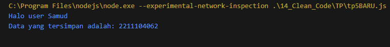

# TP MODUL 14
<big> **Nama: Muhammad Samudra** </big> 
<big> **NIM: 2211104062** </big>

---
Saya mengambil dari TP praktikum 5:
`tp5LAMA.js` :
```js
class HaloGeneric {
    SapaUser(user) {
        console.log(`Halo user ${user}`);
    }
}

const halo = new HaloGeneric();
halo.SapaUser("Samud");

class DataGeneric {
    constructor(data) {
        this.data = data;
    }

    PrintData() {
        console.log(`Data yang tersimpan adalah: ${this.data}`);
    }
}

const nim = "2211104062";
const dataGeneric = new DataGeneric(nim);
dataGeneric.PrintData();
```

Berikut adalah program yang telah direfaktor agar memenuhi standar code"
`tp5BARU.js`
```js
// Mengikuti konvensi penamaan PascalCase untuk class dan camelCase untuk method & variabel
class HaloGeneric {
    // Method menggunakan camelCase
    sapaUser(user) {
        console.log(`Halo user ${user}`);
    }
}

// Pembuatan instance
const halo = new HaloGeneric();
halo.sapaUser("Samud");

// Class generic untuk menyimpan data
class DataGeneric {
    // Constructor dengan parameter sesuai nama atribut
    constructor(data) {
        this.data = data;
    }

    // Method menggunakan camelCase
    printData() {
        console.log(`Data yang tersimpan adalah: ${this.data}`);
    }
}

// Deklarasi variabel menggunakan camelCase dan const jika tidak diubah
const nim = "2211104062";
const dataGeneric = new DataGeneric(nim);
dataGeneric.printData();

```

Refactor yang dilakukan pada kode diatas disesuaikan dengan ketentuan TP modul 14, yakni :
- Naming convention
    - Variable / Property / Attribute
    - Method / Function / Procedure
- White space dan indentation
- Variable / attribute declarations
- Comments

### Output:
