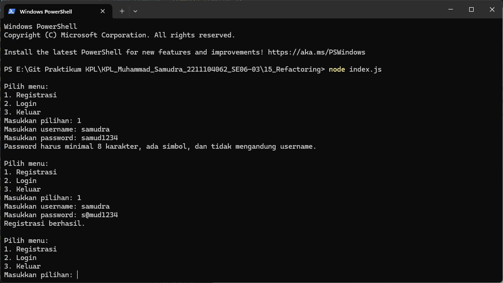
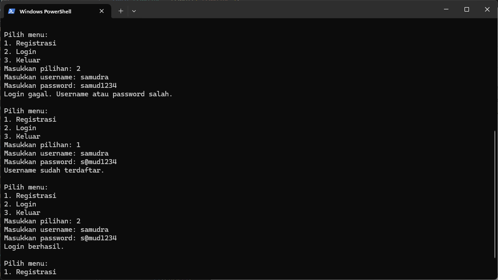
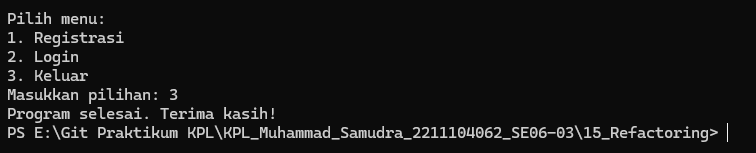
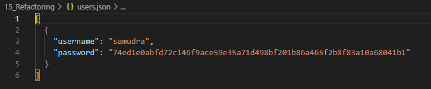

# JURNAL MODUL 15
<big> **Nama: Muhammad Samudra** </big> 
<big> **NIM: 2211104062** </big>

---
### Program:
`userManager.js`
```js
// userManager.js
const fs = require("fs");
const crypto = require("crypto");

const file = "users.json";

// Utility: hash password
function hashPassword(password) {
    return crypto.createHash("sha256").update(password).digest("hex");
}

// Validasi input
function isValidUsername(username) {
    return /^[a-zA-Z]{3,20}$/.test(username); // hanya huruf, 3-20 karakter
}

function isValidPassword(password, username) {
    const minLength = 8;
    const specialChar = /[!@#$%^&*]/;
    return (
        password.length >= minLength &&
        specialChar.test(password) &&
        !password.includes(username)
    );
}

function readUsers() {
    if (!fs.existsSync(file)) return [];
    const content = fs.readFileSync(file, "utf-8");
    return JSON.parse(content);
}

function writeUsers(users) {
    fs.writeFileSync(file, JSON.stringify(users, null, 2));
}

// Fungsi registrasi
function registerUser(username, password) {
    if (!isValidUsername(username)) {
        console.log("Username harus huruf ASCII (3-20 karakter).");
        return;
    }
    if (!isValidPassword(password, username)) {
        console.log("Password harus minimal 8 karakter, ada simbol, dan tidak mengandung username.");
        return;
    }

    const users = readUsers();
    if (users.find(u => u.username === username)) {
        console.log("Username sudah terdaftar.");
        return;
    }

    const hashed = hashPassword(password);
    users.push({ username, password: hashed });
    writeUsers(users);
    console.log("Registrasi berhasil.");
}

// Fungsi login
function loginUser(username, password) {
    const users = readUsers();
    const hashed = hashPassword(password);
    const user = users.find(u => u.username === username && u.password === hashed);
    if (user) {
        console.log("Login berhasil.");
    } else {
        console.log("Login gagal. Username atau password salah.");
    }
}

module.exports = { registerUser, loginUser };

```

`index.js`
```js
const readline = require("readline");
const { registerUser, loginUser } = require("./userManager");

const rl = readline.createInterface({
    input: process.stdin,
    output: process.stdout,
});

function tampilkanMenu() {
    console.log("\nPilih menu:");
    console.log("1. Registrasi");
    console.log("2. Login");
    console.log("3. Keluar");

    rl.question("Masukkan pilihan: ", function (menu) {
        if (menu === "1") {
            rl.question("Masukkan username: ", function (username) {
                rl.question("Masukkan password: ", function (password) {
                    registerUser(username, password);
                    // Kembali ke menu
                    tampilkanMenu();
                });
            });
        } else if (menu === "2") {
            rl.question("Masukkan username: ", function (username) {
                rl.question("Masukkan password: ", function (password) {
                    loginUser(username, password);
                    // Kembali ke menu
                    tampilkanMenu();
                });
            });
        } else if (menu === "3") {
            console.log("Program selesai. Terima kasih!");
            rl.close();
        } else {
            console.log("Menu tidak tersedia.");
            // Kembali ke menu
            tampilkanMenu();
        }
    });
}

// Jalankan program
tampilkanMenu();
```

### Penjelasan Singkat

 `index.js`       : Program utama. Menampilkan menu, membaca input, dan mengatur alur           
 `userManager.js` :Modul berisi fungsi `registerUser()` dan `loginUser()` + validasi            
 `users.json`     :File tempat penyimpanan data user (username & password yang sudah di-*hash*) 

**Alur Program**
1. Program menampilkan menu:

    - 1. Registrasi

    - 2. Login

    - 3. Keluar

2. Jika pengguna memilih:

    - Registrasi:

        - Input username & password

        - Divalidasi & disimpan ke users.json

    - Login:

        - Input username & password

        - Dibandingkan dengan data yang ada

        - Diberi notifikasi apakah berhasil/gagal

3. Setelah selesai, program kembali ke menu utama.

4. Jika memilih opsi "Keluar", program ditutup.

### Output




Isi file users.json setelah user registrasi:

